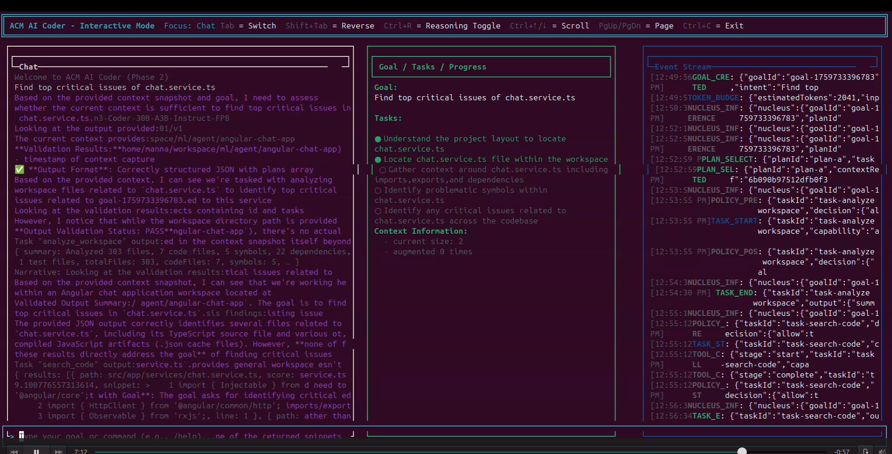

# ACM Usecases and Capabilities

Mahmudur R Manna  
Founder, DDSE (Decision Driven Software Engineering) Foundation

October 6, 2025

> Framework Implementation Link: [github.com/ddse-foundation/acm](https://github.com/ddse-foundation/acm)

---

## Table of Contents

[Executive Summary](#executive-summary)

[Use Cases](#use-cases)

- [Entitlement Decisioning](#entitlement-decisioning)
- [Knowledge Acceleration](#knowledge-acceleration)
- [Incident Triage](#incident-triage)
- [Invoice Reconciliation](#invoice-reconciliation)
- [Agent Coaching](#agent-coaching)

[Comparative Notes: LangGraph and Microsoft Agent Framework](#comparative-notes-langgraph-and-microsoft-agent-framework)

[ACM AI Coder (Interactive Demo)](#acm-ai-coder-interactive-demo)

[Conclusion](#conclusion)

---

## Executive Summary

This paper presents five practical, spec-driven workflows implemented with the ACM Framework (Node.js reference). Each example targets a real enterprise need and deliberately stresses areas where typical agent frameworks struggle: structured context intake, deterministic tool governance, end-to-end auditability, and safe long-running orchestration.

Across all five, ACM’s contract layer — Goals, Plans, Capabilities, Tasks, and Tool envelopes — plus normative artifacts (Context Packets, Memory Ledger, Replay Bundles, Nucleus reasoning) convert stochastic planning into reproducible execution. Where alternatives (e.g., LangGraph or Microsoft Agent Framework) provide excellent orchestration and multi-agent patterns, ACM adds a standard, vendor-neutral contract that enforces spec accuracy, observability, and replay by default. The result: faster implementation cycles, safer automation, and easier audits.

Concrete artifacts for these scenarios live in `framework/node/packages/acm-examples` and their successful runs are captured in `framework/node/packages/acm-examples/docs/successrun.md`. The five scenarios are also enumerated in the release plan (`framework/node/docs/tdr/IMPLEMENTATION_PLAN_FIRST_RELEASE.md`).

---

## Use Cases

Each section below covers: business perspective, workflow complexity, baseline challenges in other frameworks, how ACM resolves them, and why this scenario was chosen.

### Entitlement Decisioning

Business perspective: Determine whether a customer qualifies for a premium benefit before taking costly downstream actions. A wrong decision creates fairness issues and financial risk.

Workflow complexity: Requires consistent rules evaluation, rationale capture, and optional notification of a supervisor. Inputs come from customer data and policy rules; the result must be auditable and reproducible.

Challenges without ACM (LangGraph/MAF alone):

- Hard to enforce a stable, versioned rules interface (tools may be called in ad-hoc ways).
- Reasoning and decision steps are not guaranteed to be captured in a uniform ledger for audit. Replay often covers prompts, not full context+plan semantics.
- Policy/verification integrations tend to be bespoke, scattered across code.

How ACM makes it smooth:

- Capability contracts for `evaluate_entitlement` and `notify_supervisor` bind schemas and invariants; any hallucinated step is rejected during plan validation.
- Context Packet snapshot prevents mid-run data drift; Memory Ledger records the decision and rationale.
- Verification/policy hooks gate the decision and the notification branch, producing a clean audit trail.

Why this scenario: Entitlements are a canonical fairness and governance use case. It demonstrates ACM’s bias-aware, repeatable decision path.  
Evidence: `scenarios.entitlement` in `acm-examples` with successful run logs in `docs/successrun.md`.

### Knowledge Acceleration

Business perspective: Summarize knowledge-base snippets for support engineers under time pressure, plus generate actionable follow-ups.

Workflow complexity: Deterministic search + LLM summarization + structured follow-up generation. Needs provenance, limits on hallucination, and guarantee that a summary exists before moving on.

Challenges without ACM:

- Retrieval + generation pipelines become brittle if context evolves during execution; reproducing the exact run is difficult.
- Enforcing that a summary and follow-ups meet acceptance criteria is ad hoc.

How ACM makes it smooth:

- Context Packet freezes the knowledge snapshot; Nucleus preflight can request specific artifacts via the external context provider.
- Capability/Task guards ensure at least one snippet found; verification checks summary presence and follow-ups shape.
- Replay Bundle captures the full chain for QA and training feedback loops.

Why this scenario: A high-frequency workflow in support operations where reproducibility and explainability matter to quality and training.

### Incident Triage

Business perspective: Classify incident severity and route to the correct queue with possible escalation. SLA and compliance demands are strict.

Workflow complexity: Branching based on severity; deterministic queue selection; optional escalation. Requires visible rationale and guarantees that routing happened correctly.

Challenges without ACM:

- Branching logic can be hidden inside prompts or glue code, making audits and RCA harder.
- Ensuring that severity and queue are always set requires manual checks sprinkled across code.

How ACM makes it smooth:

- Plan graph explicitly models branches; Memory Ledger records `BRANCH_TAKEN` and task outcomes.
- Policy hooks can enforce SLA/priority rules; verification confirms queue selection.

Why this scenario: Incident management is a classic operations process with strong governance needs; perfect to showcase ACM’s auditable branching.

### Invoice Reconciliation

Business perspective: Compare invoices vs purchase orders to detect discrepancies and archive findings. Errors have direct financial impact.

Workflow complexity: Deterministic data fetch, comparison, and report archival. Must be idempotent (no double writes) and traceable.

Challenges without ACM:

- Mixed LLM + deterministic steps complicate logging; comparison details and report provenance can get lost.
- Idempotency and compensation paths are easy to overlook in ad-hoc agents.

How ACM makes it smooth:

- Tasks `fetch_invoice`, `fetch_purchase_order`, `compare_line_items`, `record_findings` are typed with schema; execution is idempotent by contract.
- Guards and compensation branches are part of the Plan definition; all outcomes logged to the ledger and bundle.

Why this scenario: A bread-and-butter back-office process where deterministic correctness and audit dominate. Demonstrates ACM’s contract-first tooling.

### Agent Coaching

Business perspective: Analyze a transcript, generate coaching feedback, and log the coaching note. Impacts agent performance and compliance.

Workflow complexity: LLM analysis and generation, with deterministic logging and acceptance checks (e.g., feedback summary must exist; note must be stored).

Challenges without ACM:

- Hard to ensure consistent input snapshot and guarantee storage of coaching notes; multi-step observability is limited.

How ACM makes it smooth:

- Nucleus-driven reasoning keeps preflight/invoke/postcheck consistent across runs; capability guards validate outputs.
- Replay Bundle provides training artifacts for supervisors; Memory Ledger shows reasoning snippets (NUCLEUS_INFERENCE) for transparency.

Why this scenario: Demonstrates the human-in-the-loop and coaching aspects that benefit from transparent reasoning.

---

## Comparative Notes: LangGraph and Microsoft Agent Framework

Both LangGraph and Microsoft Agent Framework (MAF) provide strong orchestration and agent patterns (graph-based flows, multi-agent collaboration, approvals). ACM complements them by supplying a standard contract and mandatory artifacts:

- Contracted Plans: ACM Plans are validated against Capabilities/Tasks with schemas before execution, catching hallucinated steps up front.
- Context Discipline: Immutable Context Packets with provenance make runs reproducible; most frameworks leave this as an exercise.
- Built-in Audit: Memory Ledger and Replay Bundles are normative, not optional. They capture reasoning snippets, tool calls, branches, policy decisions, and outputs.
- Engine Agnostic: ACM can execute on different runtimes (including adapters for LangGraph/MAF style engines), preserving the same contract and artifacts.

For organizations already using LangGraph or MAF, ACM can be layered as the planning/execution contract — reducing glue code and improving governance without forcing a platform switch.

---

## ACM AI Coder (Interactive Demo)

The `@acm/aicoder` package (`framework/node/packages/acm-aicoder`) is a practical TUI demonstrating how ACM accelerates building complex, tool-rich applications:

- Nucleus integration: A shared LLM call with structured tool calls and hooks (preflight/postcheck) drives reasoning; NUCLEUS_INFERENCE reasoning is surfaced live in the UI.
- Tool discipline: File, grep, search, diff, edit, build, and test tools are registered under a governed policy engine with allowed paths.
- Context provider: Workspace context retrieval is mediated through an `ExternalContextProviderAdapter`, enabling explicit, auditable context fetches.
- Replay by design: Each session emits a Replay Bundle (session config, ledger, budget) under `.aicoder/replays/<timestamp>` inside the selected workspace.
  

Complexities resolved by ACM:

- Deterministic orchestration: The `ACMFramework` wrapper manages planning+execution with a single interface, including ledger wiring.
- Observability: The Memory Ledger subscription streams events and reasoning into the UI without bespoke logging per tool.
- Governance and safety: Policy checks, tool input schemas, and allowed-path fences make editing and command execution safe-by-default.
- Speed of development: Because Capabilities/Tasks/Tools follow known contracts, adding new developer actions (e.g., refactor or test generation) is low-friction.

Note: As of v0.5.0, the Node implementation is complete for Nucleus; Python and Java SDKs are planned for upcoming releases. The CLI now enforces an explicit `--workspace` (no fallback) to avoid accidental execution outside the intended project root.

---

## Conclusion

These five examples show that ACM’s contract-first approach turns AI-driven workflows into predictable, testable, and auditable systems:

- Plans that compile: hallucinated steps and schema mismatches are rejected before execution.
- Context that stands still: immutable packets ensure comparable outcomes over time.
- Evidence you can trust: Memory Ledger and Replay Bundles make audits and RCA straightforward.
- Engines you can swap: adapters let you keep your orchestrator of choice while retaining ACM’s guarantees.

For enterprises, this means faster delivery with lower risk. For engineers, it means workflows that behave like real software: typed, versioned, and debuggable. ACM doesn’t replace great orchestrators — it makes them safer and more transparent. The result is practical, production-grade agent systems that stand up to both business scrutiny and engineering rigor.
