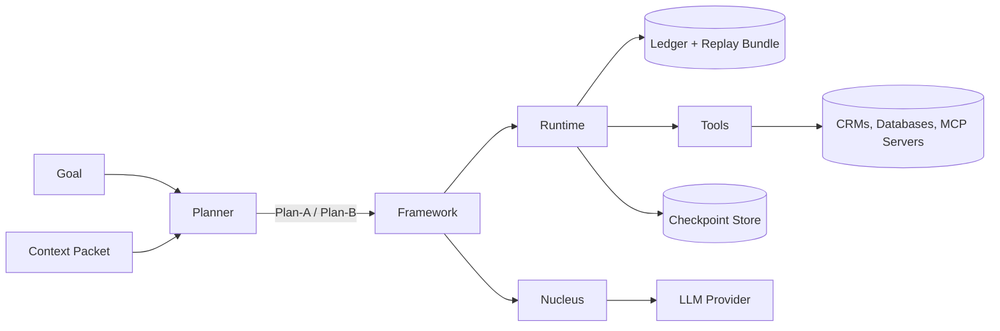

ACM splits an agent system into layered contracts so each decision can be audited, reproduced, and replayed. The layers remain language agnostic; this documentation focuses on the Node.js reference implementation that ships with v0.5.0.

## Three-layer intent stack

1. **Planner** — Generates multiple plan candidates, hashes the context, and records rationale.
2. **Framework helper** — Orchestrates planner + runtime, selects plans, wires streaming, policies, and checkpoints.
3. **Runtime** — Executes the selected plan deterministically, evaluating guards and emitting ledger entries.
4. **Nucleus** — Governs LLM usage with deterministic prompts, allowed tool lists, and streaming output.

## Contracts and artifacts

| Artifact | Produced by | Stored in | Purpose |
| -------- | ----------- | --------- | ------- |
| Goal | Developer or upstream system | Ledger & replay bundle | Desired intent and constraints |
| Context Packet | Context builders / MCP integrations | Ledger & replay bundle | Immutable facts for planning and execution |
| Capability Map | Capability registry | Source control | Declares allowed tasks and schemas |
| Plan (A/B) | Planner | Ledger & replay bundle | Directed acyclic graph of tasks with guards |
| Ledger entries | Runtime | Ledger store | Append-only decision log for audits |
| Replay bundle | Replay exporter | File system / object store | Portable snapshot for verification and regression |
| Checkpoints | Runtime | Checkpoint store | Resume execution mid-plan |

## Package topology

| Layer | Key packages |
| ----- | ------------ |
| Contracts & helpers | `@ddse/acm-sdk`, `@ddse/acm-framework` |
| Planning | `@ddse/acm-planner`, `@ddse/acm-llm` |
| Execution | `@ddse/acm-runtime`, `@ddse/acm-replay` |
| Integrations | `@ddse/acm-adapters`, `@ddse/acm-mcp` |
| Experiences | `@ddse/acm-examples`, `@ddse/acm-aicoder` |

## Runtime decisions

During execution the runtime produces a timeline of **ledger entries**:

1. `PLAN_SELECTED` — which plan was chosen and why.
2. `TASK_START` / `TASK_END` — the lifecycle of each task, including retries.
3. `GUARD_EVAL` — deterministic evaluation of guard expressions.
4. `POLICY_PRE` / `POLICY_POST` — decisions from your policy engine.
5. `VERIFICATION` — success/failure of success criteria.
6. `ERROR` / `COMPENSATION` — fallback logic and recovery actions.

These entries populate the replay bundle alongside planner metadata and tool-call envelopes so teams can reproduce decisions offline.

## Version-aware documentation

The diagrams, tables, and links on this site reference **ACM v0.5.0**. When v0.6 or later ships, the documentation will be versioned so you can:

- Keep the v0.5.0 guides while migrating to newer releases.
- Compare schema changes and runtime behaviours across versions.
- Share stable URLs tied to a specific contract version for audits.

## Further reading

- [Framework architecture narrative](https://github.com/ddse-foundation/acm/blob/main/framework/architecture.md)
- [Resumable executor runbook](../governance/resumable.md)
- [Implementation plans](../specification/artifacts.md)
