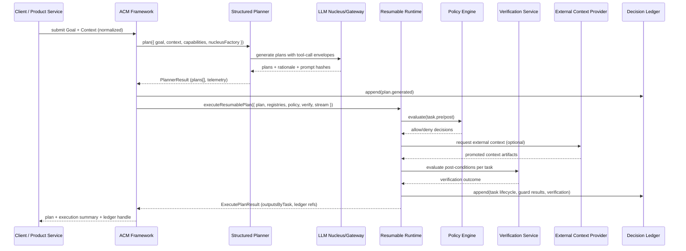

# ACM Framework Architecture (ACM v0.5 Alignment)

## 0. Rationale — Why ACM (Across Languages)

The ACM Framework exists to provide the missing contract layer between stochastic planning (human or LLM-authored Goals/Plans) and deterministic execution. Orchestrators like Temporal, Argo, Flyte, Dagster, and Prefect offer durable execution. Agent stacks like LangChain, Semantic Kernel, and Microsoft Agent Framework focus on reasoning and tool use. What is missing is a unified, versioned artifact model and lifecycle that connects planning to execution in a way that is auditable, replayable, and policy-aware.

ACM v0.5 defines this layer. It treats the following as first-class, linked artifacts:

- **Goal**, **Context Packet**, **Plan**, **Capability**, **Task**, and **Tool**
- A context lifecycle (ingest → snapshot → augment → version) enforced before planning
- Replay bundles that couple planner outputs (prompt digests, alternatives, telemetry) with runtime decisions (ledger entries, guard evaluations, checkpoints)
- Policy, verification, and external context retrieval as explicit runtime services

The ACM Framework is designed to be language-agnostic with reference implementations in multiple languages (today: JavaScript/TypeScript; planned: Python and Java). Regardless of language, the framework delivers the same “thin middle” described by `spec/acm-spec v0.5.md`:

1. **Capability Map + Task Contracts:** Typed registries and task abstractions ensure planners target only certified capabilities. This avoids free-form tool calls and supports governance.
2. **Deterministic Planner/Runtime Bridge:** Structured planners emit plan candidates with rationale and tool-call envelopes; a deterministic runtime executes those plans while honoring guard expressions, policy gates, verification, and checkpointing.
3. **Replayable Decision Memory:** An append-only decision ledger and resumable execution produce replay bundles suitable for audit and analysis.
4. **Interoperability with Existing Agent Runtimes:** Adapters connect the ACM contracts to popular agent runtimes (for example, LangGraph or Microsoft Agent Framework) without giving up ACM’s artifact guarantees.

In short, ACM is not another orchestrator. It is the contract layer that standardizes the bridge between declarative, high-variance planning and deterministic execution systems.

## 1. Major Concepts and Building Blocks

These concepts mirror ACM v0.5 and apply uniformly across language implementations:

### Goal & Context Packet

- **Goal Card**: A structured intent capture shared by planner and runtime. The framework synthesizes stable identifiers and ensures intent metadata exists before any execution.
- **Context Packet**: Immutable fact maps with provenance references. The framework normalizes identifiers and enforces lifecycle rules before planning.

### Plan & Planner Result

- **Structured Plans**: Planners emit multiple plan candidates with rationale, prompt hashes, alternative branches, and explicit task-graph topology.
- **Plan Selection**: The orchestrator accepts custom selectors and can default to deterministic selection to satisfy auditability.

### Capability Registry & Task Contracts

- **Capability Registry**: The operational expression of the Capability Map. Capabilities bundle IO schemas, invariants, and metadata used by both planner and runtime.
- **Task Contracts**: Logical execution units beyond single tool calls. Tasks own idempotency, guard expressions, retry/backoff, and typed failure taxonomies, and may orchestrate multiple tool invocations internally.

### Tool Registry & Tool Call Envelope

- **Tool Registry**: Maintains approved tool implementations and discovery mechanisms (including, for example, Model Context Protocol tools).
- **Tool-Call Envelope**: Standard instrumentation emitted during planning and execution to create replayable artifacts.

### Policy, Verification, and External Context

- **Policy Engine**: Runtime hook that routes to external or embedded policy evaluators (for example, OPA/Rego), ensuring separation of concerns.
- **Verification Hooks**: Pluggable verification grammar ensures acceptance criteria are enforced outside task logic.
- **External Context Provider Adapter**: Bridges nucleus requests for context retrieval to developer-owned retrieval tools, keeping context hydration declarative.

### Decision Memory & Replay Bundles

- **Decision Ledger**: Append-only log for planner and runtime events (task lifecycle, guard outcomes, policy decisions, LLM calls). Serves as the seed for ACM replay bundles.
- **Checkpointing & Resume**: Resumable execution with checkpoint stores (file or custom) supports long-running and regulated workflows.

## 2. Major Components

| Component | Responsibilities |
|-----------|------------------|
| **Contracts & Registries** | Defines Goal, Context, Plan, Capability, Task, Tool, Policy, Verification, StreamSink, and nucleus abstractions; supplies registries and adapters used across the stack. |
| **Structured Planner** | Generates plan alternatives with rationale, allowed tool sets, prompt digests, and nucleus telemetry; provides fan-out control and selectors for deterministic plan choice. |
| **Deterministic Runtime** | Executes plans with guard evaluation, verification, policy gates, retry/backoff, ledger logging, streaming, and resumable checkpointing. |
| **High-Level Orchestrator** | Wraps planner, runtime, adapters, and nucleus wiring in a single plan/execute API; normalizes goal/context artifacts and propagates ledger state for audits. |
| **Adapters** | Integrates with agent frameworks (for example, LangGraph, Microsoft Agent Framework) and with Model Context Protocol servers while retaining ACM contracts. |
| **LLM Gateway/Nucleus** | Provides a deterministic interface to LLMs (for example, OpenAI-compatible, Ollama, vLLM) used by planners and for nucleus-level reasoning. |
| **Examples & Tooling** | Demonstrates canonical workflows and end-to-end assistant experiences, including ledger inspection and replay bundle export. |
| **Replay & Analysis** | Packages, validates, and loads replay bundles that combine planner metadata with runtime logs. |

Language bindings: A reference implementation exists today, and ports for Python and Java follow the same contracts. The architecture intentionally separates contracts from language-specific runtime details.

## 3. Component & Data Flow Diagrams

### 3.1 Component Relationships

```text
Planner Layer (Reasoning Contracts)
  Goal Card ----------+
  Context Packet -----+----> Framework façade
  Capability Registry -+
  Structured Planner

Integration Layer (Glue)
  Framework orchestrates:
    • Deterministic LLM nucleus/gateway
    • Execution engine selectors
    • Ledger propagation and streaming sinks
    • External adapters (agent-framework bridges, MCP)

Runtime Layer (Deterministic Execution)
  Resumable Runtime (deterministic execution)
    → emits decision-ledger entries
    → invokes Policy Engine hooks
    → calls Verification services
    → optionally hydrates External Context Provider adapters

Primary Data Paths
  Goal/Context  -> Framework -> Planner -> Plan Result
  Plan Result   -> Framework -> Runtime -> Task Outputs
  Ledger events -> Decision Ledger -> Replay/analytics surfaces
  Policy/Verify -> Guard execution -> Task acceptance/retry signals
```

### 3.2 End-to-End Data Flow



## 4. Engineering Decision Justification

1. **Contract-First Abstractions:** Centering on typed contracts and registries enforces ACM v0.5’s requirement that planners only target approved capabilities. This prevents tool drift and reduces blast radius.

2. **Deterministic Planner/Runtime Split:** Separating planning from execution enables independent evolution of reasoning and runtime engines. It aligns with plan alternatives and branch semantics while allowing teams to bring their own execution backends via adapters.

3. **Ledger-Driven Observability:** An append-only decision ledger provides tamper-evident decision memory. Coupled with checkpointing, it satisfies audit and replay obligations.

4. **Nucleus Integration via Factories:** A nucleus factory lets teams plug deterministic or provider-specific LLM gateways without modifying planner logic. This centralizes inference governance and supports prompt hashing and allowed-tool whitelists.

5. **External Context Provider Adapter:** Context retrieval is decoupled from task execution. The adapter responds to retrieval directives and promotes artifacts into the context packet, preserving immutability and provenance.

6. **Adapters over Forked Runtimes:** Rather than re-implementing features of agent runtimes (for example, LangGraph or Microsoft Agent Framework), ACM wraps them. This respects existing investments while maintaining ACM’s contracts.

7. **Resumable Execution as a First-Class Feature:** Long-running workflows demand restartability. The resumable executor and checkpoint stores meet this requirement while remaining optional for lightweight use cases.

8. **Documentation-Driven Governance:** Capability Maps, Task Specs, plans, and architecture guidance live alongside code. This version-control-first approach mirrors Infrastructure-as-Code best practices and keeps the thin layer inspectable and auditable.

Together, these decisions create a composable architecture that adheres to ACM v0.5, integrates with existing agent and orchestration ecosystems, and provides the auditability, replayability, and policy discipline teams require across languages.
